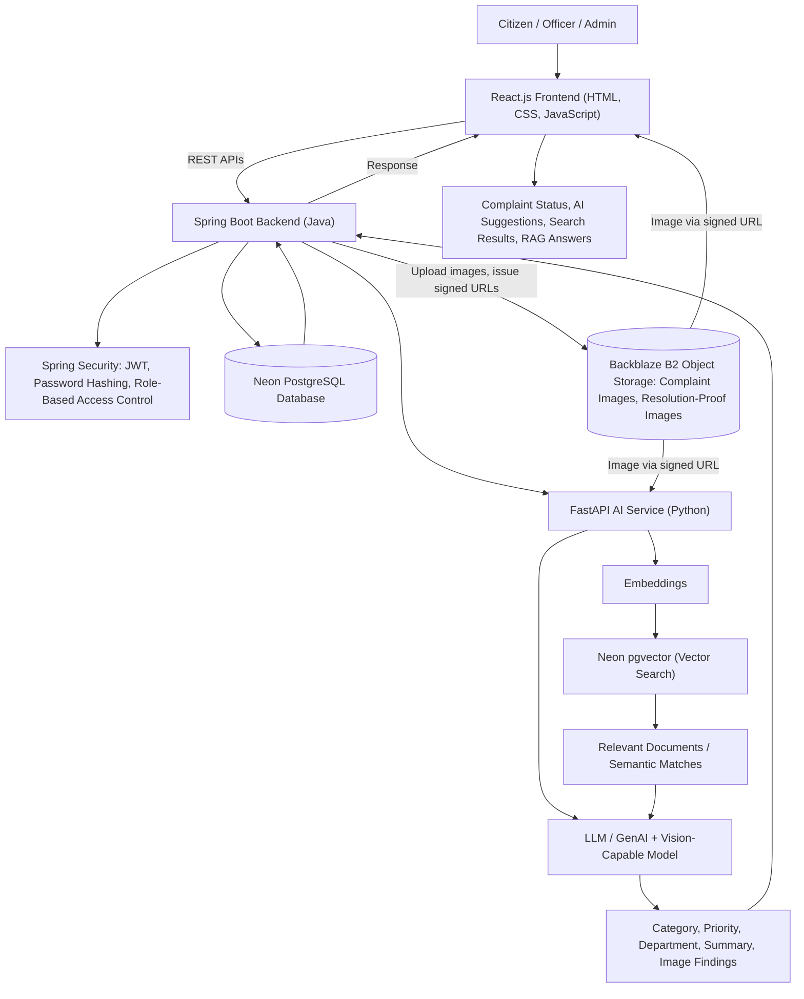

# FMC — FixMyCity: AI-Powered Civic Complaint Management System

FMC is an AI-enabled civic complaint management platform where citizens report local civic problems, track their complaints, and communicate with the responsible authorities. The system uses AI to understand complaints, analyse uploaded images, recommend categories and departments, find relevant information, and assist users through a civic knowledge assistant.

---

## Problem Statements and How It Actually Solves the Problem

### Problem 1: Citizens have no single, simple place to report a civic issue

Local problems such as potholes, garbage, broken streetlights, drainage issues, and water supply problems are often reported in scattered ways. This matters because a complaint that is not recorded properly is easy to lose.

**How FMC solves it:** FMC gives every citizen an account and a single complaint form. The citizen enters a title, description, category, and location, and uploads an image of the problem. The complaint record is saved in Neon PostgreSQL and the uploaded image is saved in Backblaze B2, linked to the complaint, so every complaint is kept in one system with all its supporting details.

### Problem 2: Complaints are often written unclearly

Many people are not sure how to describe a civic problem. A vague complaint is difficult for an officer to act on.

**How FMC solves it:** The AI Complaint Writing Assistant turns a rough description into a clearer and better-structured complaint before it is submitted. The citizen can also upload an image as supporting evidence, so the problem is visible and not only described in words.

### Problem 3: Sorting and routing complaints by hand takes time

Someone has to read each complaint, decide its category, decide how urgent it is, and decide which department should handle it. Doing this manually for every complaint is slow.

**How FMC solves it:** The AI reads the complaint description and recommends the category, a priority level (Low, Medium, or High), and the department that should handle it. AI Image Recognition checks the uploaded image for visible problems such as potholes, garbage accumulation, or damaged roads, and this detected information is used as an extra input for classification. This reduces the amount of manual classification required.

### Problem 4: Officers lose time reading long complaints

Long complaint text slows down officers who have many complaints to review.

**How FMC solves it:** AI Complaint Summarization converts a lengthy complaint into a short, clear summary that an officer can understand quickly. The officer can still open the full description, image, location, and AI analysis when needed.

### Problem 5: Citizens do not know what happened to their complaint

After submitting a complaint, people are often left with no update. This matters because it reduces trust in the process.

**How FMC solves it:** Citizens can track the current status of their complaints and see a status timeline covering Submitted, Assigned, In Progress, Resolved, and Closed. A complaint history page shows all their earlier complaints and their current status.

### Problem 6: Complaints get marked resolved even when the problem is still there

A closed complaint does not always mean a fixed problem.

**How FMC solves it:** Officers must record their work: they add investigation notes and upload resolution-proof images (stored in Backblaze B2 and linked to the complaint) before marking a complaint as resolved. If the problem is still not fixed, the citizen can request that the complaint be reopened, and can also give feedback on the resolution.

### Problem 7: Searching only by exact keywords misses relevant results

If a user searches with different words than those used in the complaint, normal keyword search returns nothing useful.

**How FMC solves it:** Complaint text and knowledge-base content are converted into embeddings (numerical representations of meaning) and stored in Neon using the pgvector extension. Semantic search then returns results that are related in meaning, even when the exact words are different.

### Problem 8: Citizens do not know the civic process

People often do not know which department handles a problem, what information to provide, or what a status label means.

**How FMC solves it:** The RAG-Based Civic Assistant first retrieves relevant content from the project's civic knowledge base, then produces an AI answer based on that retrieved content. It can answer questions such as "Which department handles streetlights?" or "What does 'In Progress' mean?" using the project's stored knowledge rather than only the model's general knowledge.

### Problem 9: There is no central view of the whole complaint system

Without an overall view, it is hard to manage departments, officers, and workload.

**How FMC solves it:** The admin dashboard lets administrators manage citizens, officers, departments, categories, and complaints, assign complaints to the right department or officer, and view basic statistics such as total, pending, and resolved complaints, category counts, and priority distribution.

---

## How It Is Unique From Others

### 1. AI is used across the whole complaint journey, not at one step

Many complaint portals only store and display complaints. In FMC, AI is involved at several points: writing help before submission, classification, priority suggestion, department recommendation, image analysis, summarization for officers, semantic search, and a civic assistant for questions.

### 2. Text and image are analysed together

The complaint description is analysed by the AI, and the uploaded image is separately analysed by AI Image Recognition. The detected image information is then used as an additional input for classification. The complaint is therefore understood from two sources instead of one.

### 3. One database serves both records and meaning-based search

FMC uses Neon (serverless PostgreSQL) as the main application database and the pgvector extension on Neon for embeddings. A separate dedicated vector database is deliberately excluded, so semantic search and RAG run on the same database platform that stores the application data. Uploaded files (complaint images and resolution-proof images) are kept out of the database and stored in Backblaze B2; Neon only stores the reference (object key) that links each file to its complaint.

### 4. Answers come from the project's own knowledge base

The RAG assistant is designed to answer using retrieved content from the project's civic knowledge base. This keeps the answers tied to the system's own information instead of relying only on general model knowledge.

### 5. Two backends, each used for what it is good at

A Java Spring Boot backend handles the core application, security, and data, while a Python FastAPI service handles the AI work. The two are connected through REST APIs, which keeps the application logic and the AI logic separate and clean.

### 6. The scope is controlled on purpose

Heavy technologies such as Kubernetes, Kafka, Redis, complex microservice orchestration, a separate vector database, complex predictive analytics, real-time IoT integration, and large-scale computer-vision pipelines are strictly excluded. The project still demonstrates full-stack development, GenAI, RAG, embeddings, vector search, image understanding, authentication, Docker, and CI/CD, without becoming an oversized enterprise system.

### 7. The full loop is covered, including what happens after resolution

The system does not stop at "resolved". Resolution proof, citizen feedback, reopening a complaint, and reassignment to another officer or department are all part of the same flow.

---

## End-to-End Diagram with Short and Simple Explanation

### Flow Explanation

1. **User action:** A citizen, officer, or admin opens FMC in the browser and performs an action, such as submitting a complaint, checking a status, or asking the civic assistant a question.
2. **Frontend:** The React.js frontend collects the input (title, description, category, location, complaint image, resolution-proof image, or a search question) and sends it to the backend through REST APIs.
3. **Backend:** The Spring Boot backend receives the request. Spring Security checks the JWT token and the user's role, so a citizen, officer, and admin each see only what they are allowed to see.
4. **File storage:** When the request includes an image (a citizen's complaint image or an officer's resolution-proof image), the backend uploads the file to a private Backblaze B2 bucket and records the file's B2 object key against the complaint in Neon PostgreSQL.
5. **AI service:** For AI-related work, the backend calls the FastAPI service built in Python, passing the complaint text and a short-lived signed URL for the complaint image stored in B2. The service fetches the image from B2 and sends the text and image to the LLM / GenAI vision-capable model.
6. **AI results:** The model returns the suggested category, priority, department, a short summary, and any problems detected in the image. These results go back to the Spring Boot backend.
7. **Semantic search and RAG:** For search queries and civic questions, the text is converted into embeddings. pgvector on Neon finds the most related stored content. The retrieved documents are passed to the LLM, which writes an answer based on them.
8. **Database:** The Spring Boot backend saves and reads complaints, users, officers, departments, categories, statuses, notes, and the B2 object keys of complaint images and resolution proofs in Neon PostgreSQL.
9. **Final output:** The backend sends the response to the frontend, where the user sees the complaint status and timeline, AI suggestions, semantic search results, or the RAG assistant's answer. When images need to be shown, the backend returns short-lived signed URLs and the browser loads the images directly from Backblaze B2.

### Where Backblaze B2 Fits in the Architecture

Backblaze B2 is the object storage layer of FMC. It holds every uploaded file, while Neon PostgreSQL continues to hold all structured application data and embeddings. No other file storage is used.

| Component | Role with Backblaze B2 |
|---|---|
| **Backblaze B2 (private bucket)** | Stores complaint images uploaded by citizens and resolution-proof images uploaded by officers. The bucket is private, so no file is publicly reachable. |
| **Spring Boot Backend** | The only component that holds the B2 credentials. It uploads files to B2 through B2's S3-compatible API and generates short-lived signed URLs whenever a file needs to be read. |
| **Neon PostgreSQL** | Stores the B2 object key for each image, linked to its complaint. It does not store the image files themselves. |
| **FastAPI AI Service** | Receives a short-lived signed URL from the backend and fetches the complaint image from B2 for AI Image Recognition. It only reads from B2 and never writes to it. |
| **React.js Frontend** | Sends images to the backend together with the complaint or resolution proof, and displays images using the signed URLs returned by the backend. It never talks to B2 with credentials. |

**Object key layout in the bucket:**

- `complaints/{complaintId}/{fileName}` for complaint images uploaded by citizens
- `resolution-proofs/{complaintId}/{fileName}` for resolution-proof images uploaded by officers

**Upload flow:** Frontend sends the image with the complaint or proof → Spring Boot checks the user's JWT and role → Spring Boot uploads the file to Backblaze B2 → Spring Boot saves the returned object key in Neon PostgreSQL alongside the complaint.

**Viewing flow:** Frontend requests a complaint → Spring Security confirms the user is allowed to see it → Spring Boot generates short-lived signed URLs for the complaint's images → the browser loads the images directly from Backblaze B2. Role-based access control therefore applies to files as well as to complaint records.

The B2 application key is supplied to the Spring Boot backend as configuration (environment variables) and is never exposed to the frontend or stored in the code repository.

---

## Technical Stack

### Languages

| Technology | Use in This Project |
|---|---|
| **Java** | Used to build the main Spring Boot backend of the application. |
| **Python** | Used to build the FastAPI AI service that handles all AI work. |
| **SQL** | Used to query and manage the Neon PostgreSQL database, including structured application data and vector similarity queries through pgvector. |

### Frontend

| Technology | Use in This Project |
|---|---|
| **HTML** | Provides the basic structure of the web pages. |
| **CSS** | Styles the pages so the portal and dashboards look clean and readable. |
| **JavaScript** | Adds behaviour and interactivity to the pages in the browser. |
| **React.js** | Builds the complete user interface: complaint forms, tracking pages, officer dashboard, and admin dashboard. |

### Backend & APIs

| Technology | Use in This Project |
|---|---|
| **Spring Boot** | The main backend. Handles complaints, users, officers, departments, statuses, and business rules, and uploads complaint images and resolution-proof images to Backblaze B2. |
| **FastAPI** | The Python AI service. Handles classification, priority, department suggestion, summarization, image recognition (reading complaint images from Backblaze B2 through signed URLs), embeddings, semantic search, and RAG. |
| **REST APIs** | The communication method used between the frontend, the Spring Boot backend, and the FastAPI AI service. |

### AI & GenAI

| Technology | Use in This Project |
|---|---|
| **LLM Integration** | Connects the system to a large language model that reads and understands complaint text. |
| **Generative AI** | Produces written output such as complaint summaries, improved complaint text, and assistant answers. |
| **Prompt Engineering** | Designing the instructions given to the model so its output is accurate and useful for civic complaints. |
| **RAG (Retrieval-Augmented Generation)** | Retrieves relevant content from the civic knowledge base first, then generates an answer based on it. |
| **Embeddings** | Converts complaint text and knowledge-base content into numerical vectors that represent meaning. |
| **Vector Search** | Compares those vectors to find the most closely related stored content. |
| **Semantic Search** | Lets users search complaints and civic information in natural language and get meaning-based results. |
| **AI Image Recognition** | Analyses uploaded complaint images, fetched from Backblaze B2, to identify visible civic problems such as potholes, garbage, or damaged roads. |

### Database

| Technology | Use in This Project |
|---|---|
| **Neon (Serverless PostgreSQL)** | The primary application database. Stores complaints, users, officers, departments, categories, statuses, notes, and the Backblaze B2 object keys that link each complaint to its images and resolution proofs. The image files themselves are not stored in the database. |
| **pgvector (on Neon)** | Stores and searches the embeddings used by semantic search and the RAG assistant. |

### File Storage

| Technology | Use in This Project |
|---|---|
| **Backblaze B2** | Object storage for all uploaded files: complaint images from citizens and resolution-proof images from officers. Files sit in a private bucket and are accessed by the Spring Boot backend through B2's S3-compatible API; users and the AI service read them only through short-lived signed URLs. |

### Security

| Technology | Use in This Project |
|---|---|
| **Spring Security** | Protects the backend and controls who can access which part of the system. |
| **JWT Authentication** | Issues a secure token after login so every later request can be verified. |
| **Password Hashing** | Stores user passwords in a hashed form instead of plain text. |
| **Role-Based Access Control** | Separates what citizens, officers, and admins are allowed to do, including which complaint images and resolution proofs stored in Backblaze B2 each user can view. |

### DevOps & Development

| Technology | Use in This Project |
|---|---|
| **Git** | Tracks changes to the project code. |
| **GitHub** | Hosts the project repository and supports team collaboration. |
| **GitHub Actions (CI/CD)** | Automates build and deployment steps whenever the code changes. |
| **Docker** | Packages the application so it runs the same way in different environments. |
| **Maven** | Builds the Java Spring Boot project and manages its dependencies. |

---

## All the Features

### A. Citizen Features

| # | Feature | What It Does |
|---|---|---|
| 1 | **User Registration & Login** | Citizens create an account and log in securely to use the complaint portal. |
| 2 | **Create Civic Complaint** | Citizens submit a complaint with a title, description, category, location, and supporting image. The complaint details are saved in Neon PostgreSQL and the image is saved in Backblaze B2. |
| 3 | **Complaint Category Selection** | Citizens choose a category such as roads, garbage, streetlights, drainage, water supply, or other civic issues, so the complaint is grouped correctly. |
| 4 | **Complaint Image Upload** | Citizens upload a photo of the problem as supporting evidence. The image is stored in Backblaze B2 and linked to the complaint through its object key. |
| 5 | **Location Submission** | Citizens provide the location or address of the issue so the right authority can handle it. |
| 6 | **Complaint Tracking** | Citizens view the current status of the complaints they have submitted. |
| 7 | **Complaint Status Timeline** | The system shows the complaint's progress through Submitted, Assigned, In Progress, Resolved, and Closed. |
| 8 | **Complaint History** | Citizens view their earlier complaints together with their current status. |
| 9 | **Reopen Complaint** | Citizens request that a resolved complaint be reopened when the problem is not actually fixed. |
| 10 | **Resolution Feedback** | Citizens give feedback after a complaint is marked as resolved. |

### B. AI Features

| # | Feature | What It Does |
|---|---|---|
| 11 | **AI Complaint Classification** | The AI reads the complaint description and recommends the most suitable category, reducing manual classification work. |
| 12 | **AI Priority Suggestion** | The AI reads the description and recommends a priority level of Low, Medium, or High. |
| 13 | **AI Department Recommendation** | The AI recommends which department should handle the complaint, based on the reported issue. |
| 14 | **AI Complaint Summarization** | The AI turns a long complaint into a short, clear summary that an officer can read quickly. |
| 15 | **AI Complaint Writing Assistant** | The AI helps a citizen turn a rough description into a clearer, better-structured complaint before submitting it. |
| 16 | **AI Image Recognition** | The system analyses the uploaded image, retrieved from Backblaze B2, to identify visible civic problems such as potholes, garbage accumulation, damaged roads, or broken infrastructure. The detected information is used as an extra input for classification. |
| 17 | **Embeddings** | Important complaint text and knowledge-base content are converted into numerical vectors so the system can compare their meaning. |
| 18 | **Vector Database** | The embeddings are stored and searched using the pgvector extension on Neon, so information can be retrieved by meaning instead of exact keywords. |
| 19 | **Semantic Search** | Users and administrators search complaints or civic information in natural language and get conceptually related results even when the wording differs. |
| 20 | **RAG-Based Civic Assistant** | The assistant retrieves relevant content from the project's civic knowledge base and generates an answer from it, for questions like "How do I report a drainage problem?" or "Which department handles streetlights?" |

### C. Officer Features

| # | Feature | What It Does |
|---|---|---|
| 21 | **Officer Login** | Authorized officers log in securely to the officer dashboard. |
| 22 | **Officer Dashboard** | Officers see the complaints assigned to them and monitor their status and priority. |
| 23 | **View Assigned Complaints** | Officers inspect the complaint description, uploaded image (loaded from Backblaze B2), location, AI analysis, and other details. |
| 24 | **Update Complaint Status** | Officers update the complaint status as the work progresses. |
| 25 | **Investigation Notes** | Officers add notes describing their investigation or the actions they took. |
| 26 | **Upload Resolution Proof** | Officers upload resolution-proof images after completing the required work. The images are stored in Backblaze B2 and linked to the complaint. |
| 27 | **Mark Complaint as Resolved** | Officers mark the complaint as resolved once the reported problem has been addressed. |
| 28 | **Reassign Complaint** | Authorized users move a complaint to another officer or department when needed. |

### D. Admin Features

| # | Feature | What It Does |
|---|---|---|
| 29 | **Admin Dashboard** | Administrators monitor the overall complaint management system. |
| 30 | **User Management** | Admins manage registered citizen accounts. |
| 31 | **Officer Management** | Admins manage officer accounts and the departments they belong to. |
| 32 | **Department Management** | Admins manage the civic departments that handle different complaint types. |
| 33 | **Complaint Management** | Admins view and manage complaints across the entire system. |
| 34 | **Complaint Assignment** | Admins assign complaints to the correct department or officer. |
| 35 | **Category Management** | Admins manage the complaint categories used by the platform. |
| 36 | **Basic Analytics** | The dashboard shows basic statistics such as total complaints, pending complaints, resolved complaints, complaint categories, and priority distribution. |
